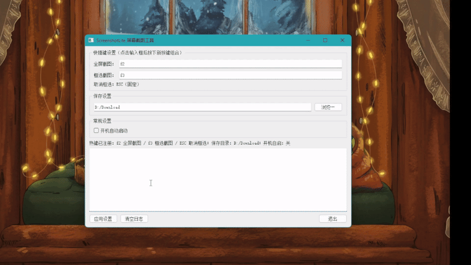
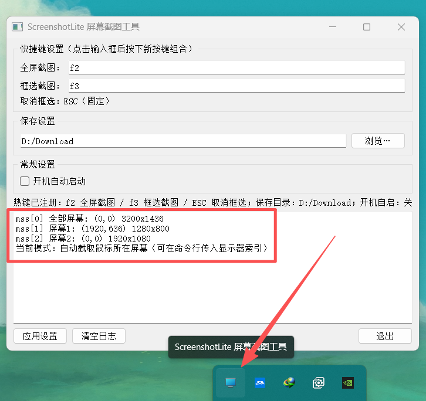
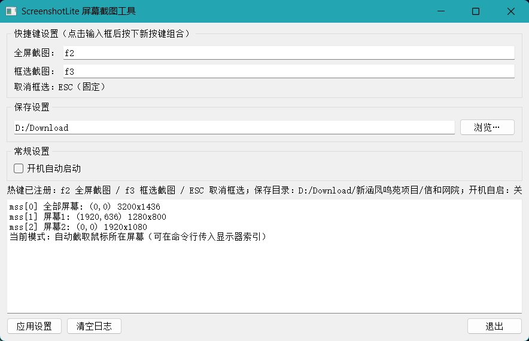

# ScreenshotLite: Ultra-Fast Screenshot Tool

> **Language:** English | [简体中文](README.md)

ScreenshotLite is a Windows screenshot tool built with **speed** as its first principle: press the hotkey and the shot is captured and saved, with the entire pipeline completing in milliseconds to make sure the frame you need is captured in time. The tool focuses on exactly one job — taking and saving screenshots.



- **Ultra-fast saving**: hotkey pressed → grab screen → encode → write to disk, the whole pipeline finishes in milliseconds. Under the hood it uses native `mss` screen capture and encodes/writes directly via `cv2.imencode` — no scaling, no transcoding, no unnecessary processing.
- **Minimal, no bloat**: screenshotting only — no bundled screen recording, editing, or cloud sync; a clean interface with single-purpose logic, simple and reliable.
- **Lightweight and always resident**: a single portable file that lives in the system tray, with global hotkeys available at any time, never getting in the way of normal work.

## Features

- **Ultra-fast saving**: the moment the hotkey fires, the shot is taken and saved; the whole pipeline finishes in milliseconds with no extra steps.
- **F2 fullscreen capture**: captures the screen the mouse is currently on; you can also pin the capture to a specific monitor via a command-line argument.
- **F3 region capture (screen freeze)**: when triggered, the current screen image is frozen first as the backdrop for region selection; drag to select an area and release the mouse to save. Ideal for capturing moving content such as videos, since it avoids grabbing the wrong frame while the picture keeps playing during selection.
- **ESC to cancel**: press ESC at any time during region selection to cancel.
- **Date-numbered saving**: files are named `YYYYMMDD_N` (e.g. `20260811_1.png`) in the save directory, with the number auto-incrementing within the same day so existing images are never overwritten.
- **GUI settings panel**: click an input box, then press the new key combination to record a custom hotkey; the save directory can be typed in directly or picked via "Browse…"; launching at startup can also be enabled.
- **System tray resident**: closing the window minimizes it to the tray; double-click the tray icon to restore the window while the hotkeys keep working.
- **Persistent configuration**: the hotkeys and save directory are stored in `capture_config.json` and take effect automatically after a restart.
- **Live log**: the window shows logs such as save paths, image sizes, and monitor info.



## Requirements

- Windows 10 / 11
- Python 3.8+

## Installation

```bash
git clone https://github.com/toki-2004/ScreenshotLite.git
cd ScreenshotLite
pip install -r requirements.txt
```

The dependencies are:

- `mss`: screen capture
- `keyboard`: global hotkeys
- `opencv-python`: image encoding and processing
- `numpy`: image arrays
- `PyQt5`: GUI and system tray

## Release build (portable)

No need to install Python or any dependencies: download `ScreenshotLite.exe` from the [Releases](https://github.com/toki-2004/ScreenshotLite/releases) page and double-click to run. The exe is packaged as a single file by PyInstaller; the configuration (`capture_config.json`) and the default screenshot directory (`input/`) both live next to the exe.

## Usage

Run it directly:

```bash
python screenshot_lite.py
```

Default behavior: F2 captures **the screen the mouse is currently on** (especially convenient in multi-monitor setups).

Pin a specific monitor:

```bash
python screenshot_lite.py 1   # pin capture to mss monitor index 1 (primary screen)
python screenshot_lite.py 2   # index 2 (second screen)
```

If the index does not exist, it automatically falls back to the screen under the mouse and logs a warning.

### Hotkeys

| Key | Function |
| --- | --- |
| F2 | Fullscreen capture (screen under the mouse, or the monitor specified on the command line) |
| F3 | Drag-to-select region capture |
| ESC | Cancel region selection |

Hotkeys can be customized in the GUI: click the "Fullscreen capture / Region capture" input box, press the new key combination (e.g. `Ctrl+F6`), then click "Apply settings" — the change takes effect immediately and is saved.



By default screenshots are saved to `input/` inside the program directory. You can change it under the GUI's "Save settings"; click "Apply settings" for the change to take effect immediately and persist.

### Configuration file

Settings are stored in `capture_config.json`:

```json
{
  "fullscreen_hotkey": "f2",
  "region_hotkey": "f3",
  "save_dir": "D:/pythonitems/ScreenshotLite/input",
  "autostart": false
}
```

If the configuration file is missing or corrupted, the defaults are used automatically and startup is unaffected. "Launch at startup" is implemented by writing to the current user's Run registry key.

## Feature verification

The following features have all been tested on Windows with multiple monitors:

- Fullscreen capture: grabbing the screen under the mouse, grabbing a monitor specified on the command line, and fallback for out-of-range indexes
- Region capture: frozen-screen backdrop, mask overlay, drag selection, save on mouse release, ESC to cancel (the saved image matches the frozen frame pixel for pixel)
- Date numbering: numbers increment as `YYYYMMDD_N`, e.g. `20260811_1.png`; files with the old naming or from other dates are excluded from numbering
- Anti-repeat: a 0.6-second cooldown, so holding the hotkey does not take repeated screenshots
- Settings panel: hotkey recording (e.g. `Ctrl+F6`), save-directory change, autostart toggle, config read/write and fallback on a corrupted config
- Tray and log: minimize to tray; the log window prints save records and monitor enumeration

## FAQ

- **Global hotkey not working?** Simply run the program as a normal user; if other programs run as administrator, the keyboard hook may fail due to privilege isolation — it is recommended to keep the program and the target program at the same privilege level.
- **Autostart setup failing?** Autostart writes to the current user's registry Run key, which only needs normal privileges; if it still fails, run the program as administrator and retry.
- **Failing to save to a path with Chinese characters?** Internally the program uses `cv2.imencode` plus binary writing, so Chinese/special-character paths are already supported.
- **Region selection misaligned on multiple monitors?** Selection coordinates are converted to absolute virtual-desktop coordinates, so there is no misalignment in any multi-screen arrangement.

## Project structure

```
ScreenshotLite/
├── screenshot_lite.py      # main program
├── dist/ScreenshotLite.exe # packaged executable (available on GitHub Releases)
├── capture_config.json     # configuration file (generated after the first run)
├── input/                  # default screenshot save directory
└── README.md
```

## License

This project is licensed under the [MIT License](LICENSE).
